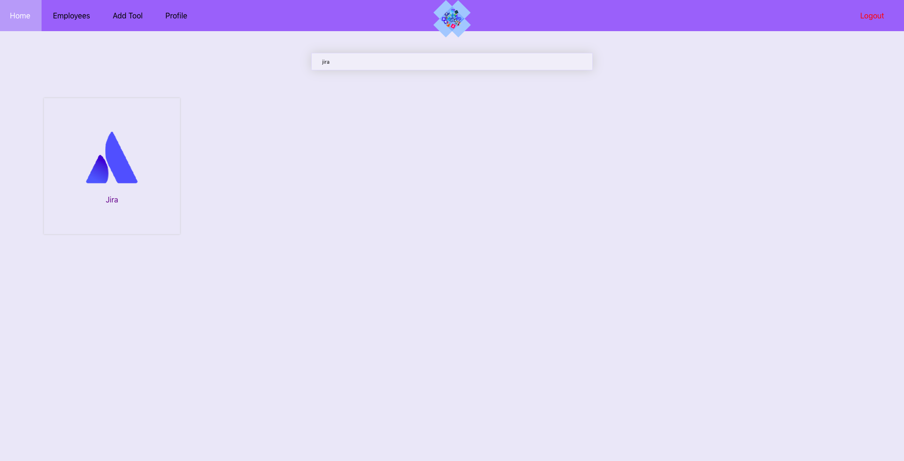

  

<h2 align="center">Toolbox</h2>

**Note**: This project requires server side which could be found [here](https://github.com/zafar-saleem/toolbox-server)

Currently many organizations use many, if not countless, online services, tools, web apps etc to bring productivity to their employees daily work. For employees, if it brings productivity on one hand then on the other hand they need to manage all these tools so that they can access them conveniently.

The current solution many employees use is the browsers default bookmarks. However, toolbox, bring all these tools at one place. All employees have to do is login to toolbox, where list of all the online services and tools can be viewed they need rather than going through inconvenient browser's default bookmark features they offer.

### All Tools Just One Click Away
All the tools employees’ use are just one click away right from home page.

### Searching Tools In Realtime
Too many tools? No problem. Realtime search makes it convenient and easy to find the right tool.

### Adding More Tools
Adding more tools are a couple of fields form with name and link to the tool.

### Adding Employees Can’t Get More Easier
As an administrator, it is way more easier to add new employees.

# Server Side of this project
Toolbox requires serverside setup in order for this run with real data. Its server side implemention can be found here. [Toolbox Serverside](https://github.com/zafar-saleem/toolbox-server).

# Technology Stack
The list of technologies used in this project are:
* React
* Redux
* React Router
* Redux Saga

# Usage
In order to use Toolbox on local environment, `clone` this repository. CD into root folder. Run `npm install` to install all dependencies. Once done, run `npm start`.

# Build for production
To build this project for production. Run `npm run build` command inside toolbox-app folder and it will generate the production ready project inside build directory. For details visit [deployment](https://facebook.github.io/create-react-app/docs/deployment) and [creating a production build](https://facebook.github.io/create-react-app/docs/production-build).

# Contributions
In order to contribute, please open issues and make pull requests.

